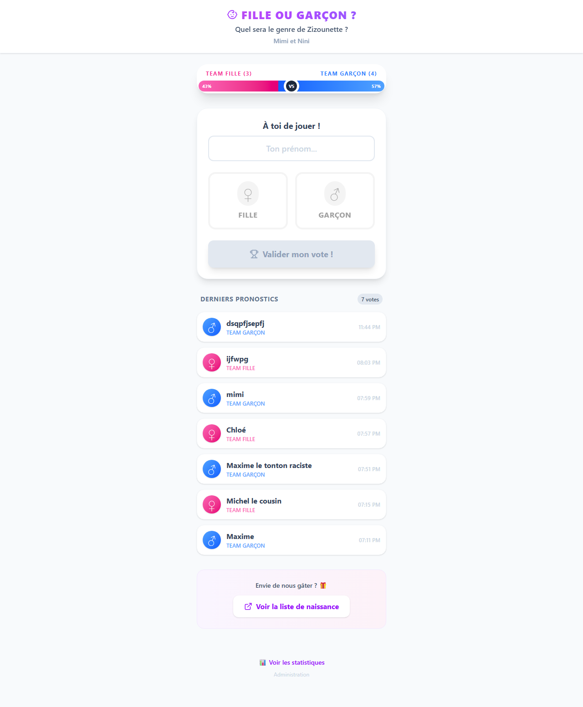
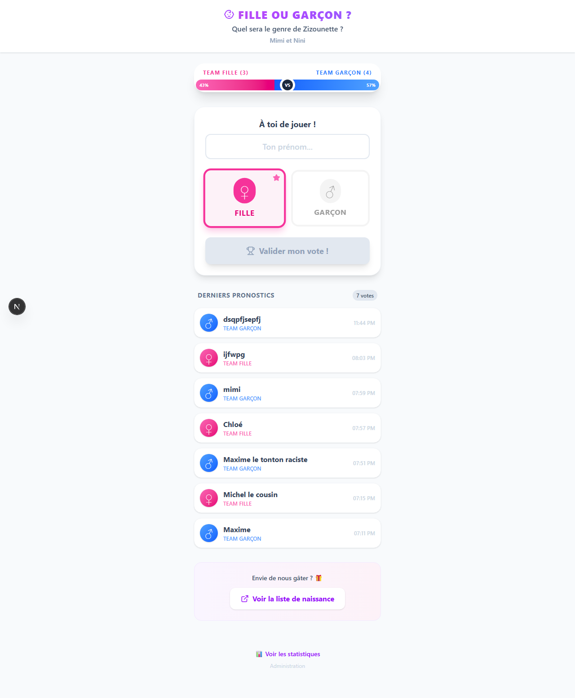
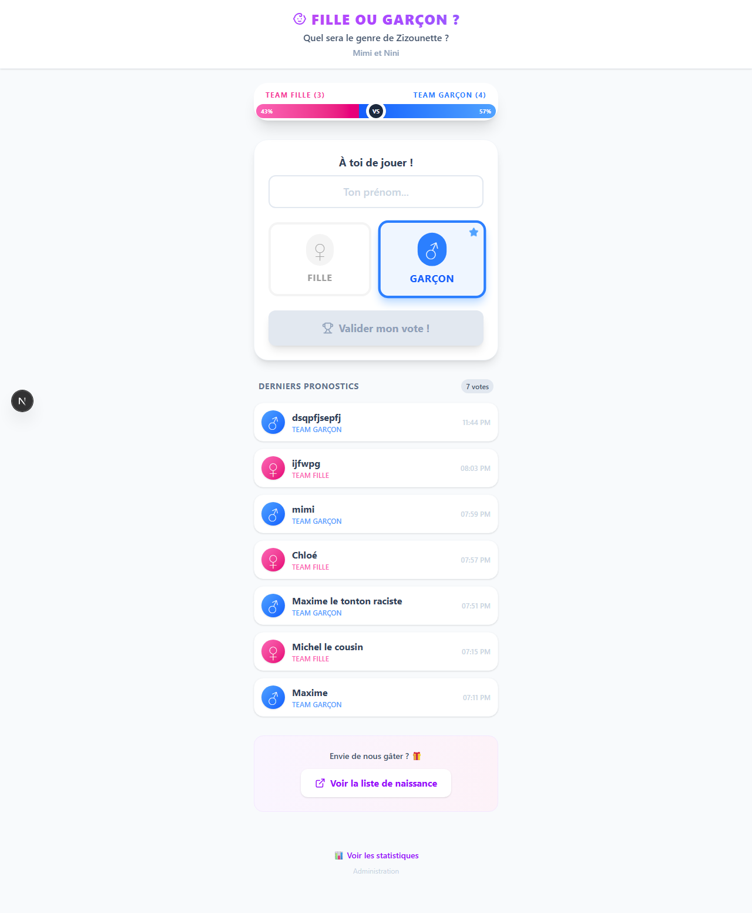
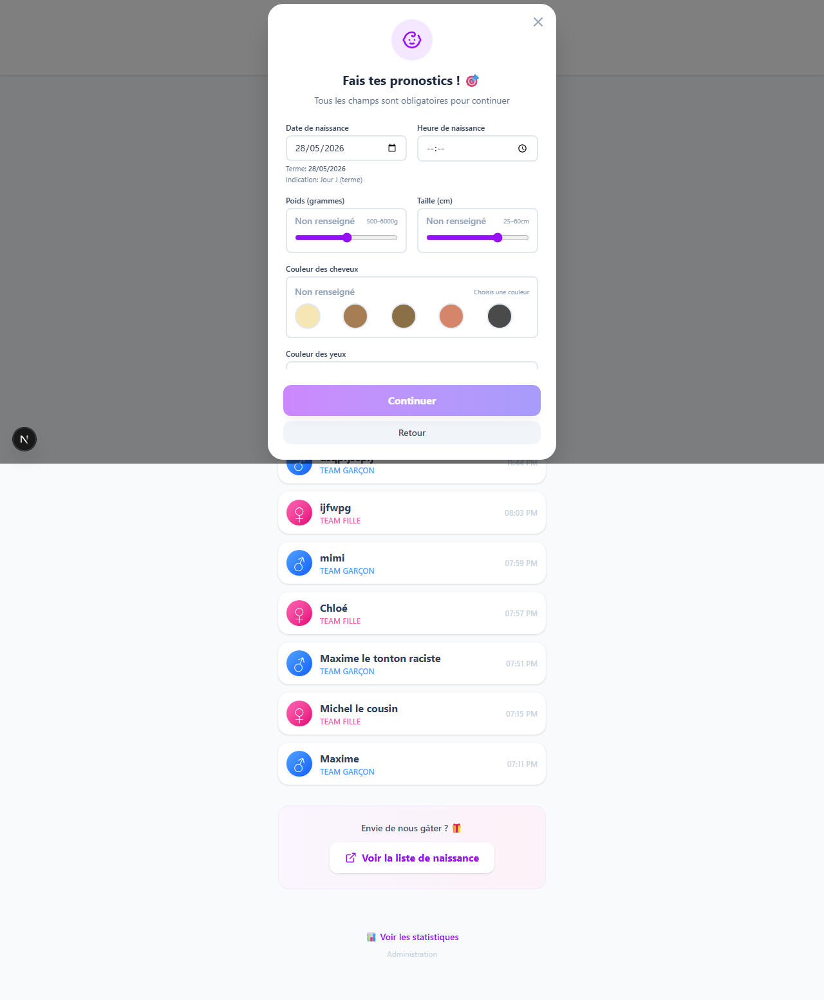
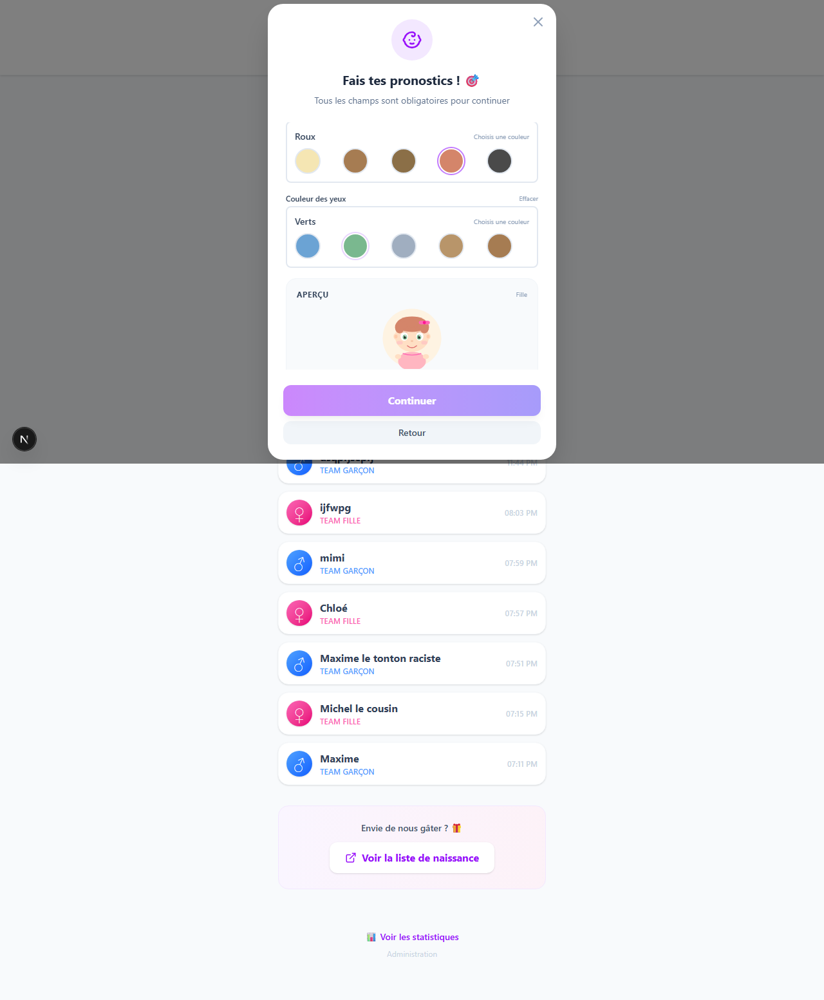
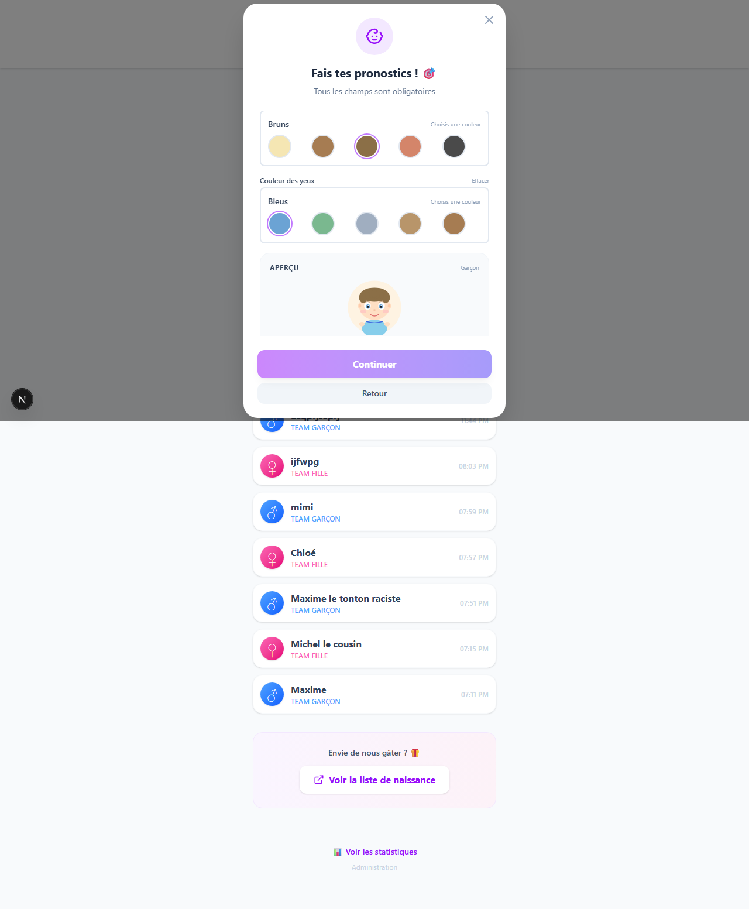
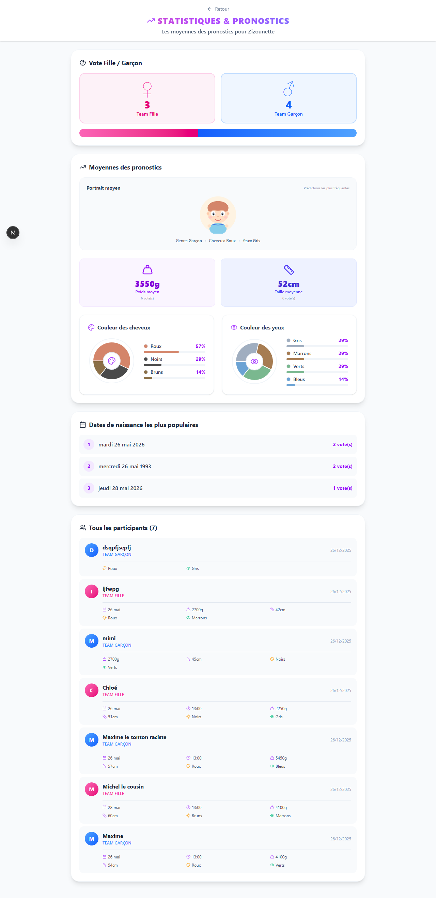
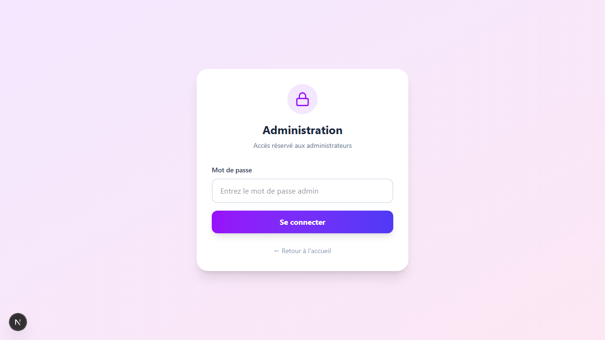
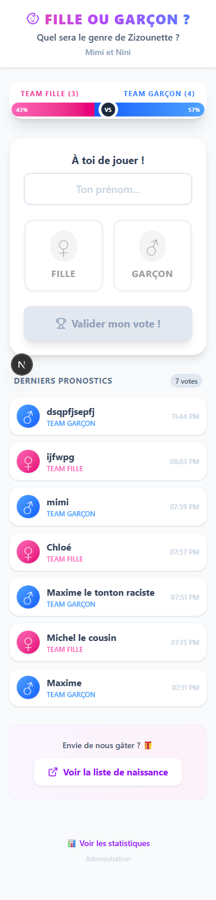
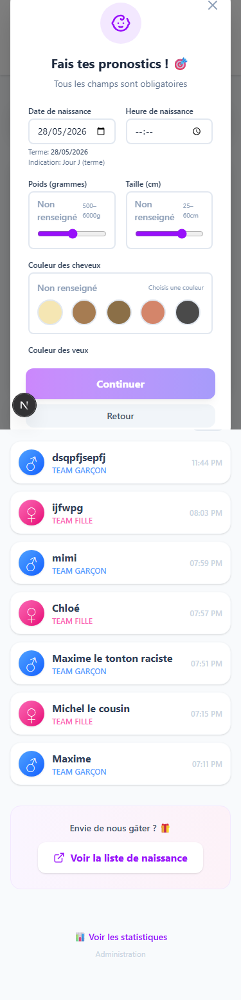

# Documentation Visuelle - Gender Reveal App

## 📱 Interface Utilisateur

### Page Principale

#### Vue Initiale


La page d'accueil permet aux utilisateurs de :
- Entrer leur prénom
- Sélectionner leur prédiction (Fille ou Garçon)
- Accéder aux prédictions avancées
- Voir les statistiques

---

#### Sélection Fille


Interface avec le bouton "Fille" sélectionné (rose).

---

#### Sélection Garçon


Interface avec le bouton "Garçon" sélectionné (bleu).

---

## 🎯 Modales - Prédictions Avancées

### Modal Prédictions


Modal permettant de faire des prédictions détaillées :
- **Date de naissance** (calendrier)
- **Heure de naissance**
- **Poids** (slider de 500g à 6000g)
- **Taille** (slider de 25cm à 60cm)
- **Couleur des cheveux** (5 options : Blonds, Châtains, Bruns, Roux, Noirs)
- **Couleur des yeux** (5 options : Bleus, Verts, Gris, Noisette, Marrons)
- **Aperçu du bébé** avec le système paperdoll

---

### Prédictions avec Couleurs


Exemple avec des couleurs sélectionnées montrant :
- L'aperçu du BabyAvatar mis à jour dynamiquement
- Les couleurs de cheveux et yeux choisies
- Le système de couches SVG modulaire

---

## 📧 Modal Email



Modal de validation finale permettant :
- D'entrer son email (optionnel)
- "Envoyer mon vote avec email"
- "Continuer sans email"

---

## 📊 Page Résultats



Page de statistiques affichant :
- Distribution des votes (♀ vs ♂)
- Portrait moyen du bébé prédit
- Statistiques détaillées (poids moyen, taille moyenne, etc.)
- Couleurs les plus votées

---

## ⚙️ Page Administration



Interface d'administration pour :
- Configurer le nom du bébé
- Définir les dates importantes
- Gérer les révélations
- Personnaliser les couleurs et icônes

---

## 📱 Version Mobile

### Page Principale Mobile


Design responsive optimisé pour mobile (375×667).

---

### Modal Mobile


Modal de prédictions adaptée aux petits écrans.

---

## 🎨 Système BabyAvatar (Paperdoll)

Le système d'avatar utilise une architecture **inspirée de DiceBear** mais entièrement personnalisée :

### Architecture en Couches SVG

```
BabyAvatar (composant principal)
├── BabyBase (tête, cou, épaules)
│   └── Couleur: skinTone prop
├── BabyEyes (yeux avec reflets, sourcils)
│   └── Couleur: eyeColor prop
├── BabyFace (nez, bouche, joues)
├── BabyHair (3 styles: default, short, curly)
│   └── Couleur: hairColor prop
├── BabyAccessory (nœud pour filles, bleu pour garçons)
│   └── Couleur: selon gender prop
└── BabyClothing (t-shirt avec ombre)
    └── Couleur: clothingColor prop
```

### Props du Composant

```typescript
interface BabyAvatarProps {
  hairColor?: string;      // Hex color
  eyeColor?: string;       // Hex color
  gender?: 'girl' | 'boy';
  size?: number;           // 96 ou 112
  skinTone?: string;       // Default: #fdd5b1
  hairStyle?: 'default' | 'short' | 'curly';
  clothingColor?: string;  // Default: #e0e7ff
}
```

### Pourquoi Pas DiceBear Directement ?

- ❌ DiceBear n'a **pas de style "bébé"**
- ❌ Les styles existants (avataaars, bottts, etc.) ne conviennent pas à un gender reveal
- ✅ Architecture paperdoll **inspirée** de DiceBear
- ✅ **SVG 100% custom** pour ressembler à un bébé
- ✅ **6 couches modulaires** pour customisation complète

### Exemple d'Utilisation

```tsx
import { BabyAvatar } from '@/components/BabyAvatar';

<BabyAvatar 
  hairColor="#d4856a"    // Roux
  eyeColor="#7ab88f"     // Vert
  gender="girl"
  size={96}
  hairStyle="curly"
/>
```

---

## 🧪 Tests Automatisés

Suite de 12 tests Playwright couvrant :
- ✅ Navigation et chargement
- ✅ Sélection de genre
- ✅ Sliders et contrôles
- ✅ Palettes de couleurs
- ✅ Avatar dynamique
- ✅ Modales (prédictions + email)
- ✅ Symboles de genre
- ✅ Responsive design

```bash
npm run test        # Tous les tests
npm run test:ui     # Interface graphique
npm run test:headed # Mode visible
```

---

## 🎯 Fonctionnalités Clés

### 1. Système de Vote Intuitif
- Champ prénom avec validation
- Boutons Fille/Garçon stylisés
- Animations et transitions fluides

### 2. Prédictions Avancées (Optionnelles)
- Date et heure de naissance
- Sliders pour poids/taille avec feedback visuel
- Palettes de couleurs interactives
- Aperçu en temps réel

### 3. Avatar Dynamique
- Rendu SVG léger et performant
- 6 couches modulaires
- Mise à jour instantanée
- Support de 3 styles de cheveux

### 4. Design Responsive
- Mobile-first (375px+)
- Tablette (768px+)
- Desktop (1024px+)
- Modales adaptatives

### 5. Statistiques Détaillées
- Graphiques de distribution
- Portrait moyen calculé
- Moyennes poids/taille
- Historique des votes

---

## 🚀 Technologies

- **Next.js 16.1** (App Router + Turbopack)
- **React 19.2**
- **TypeScript 5**
- **Tailwind CSS**
- **Playwright** (tests E2E)
- **SVG** (avatars custom)
- **Lucide Icons**

---

## 📝 Notes Techniques

### Stockage
- Fichier JSON local (`data/votes.json`, `data/config.json`)
- API Routes Next.js
- Pas de base de données externe

### Performance
- SVG optimisé (léger, pas d'images lourdes)
- Composants React memoïzés
- Chargement progressif
- Animations CSS natives

### Accessibilité
- Labels ARIA sur les boutons de couleur
- Contrôles clavier
- Contrastes WCAG AA
- Textes alternatifs

---

*Documentation générée automatiquement le 26 décembre 2025*
