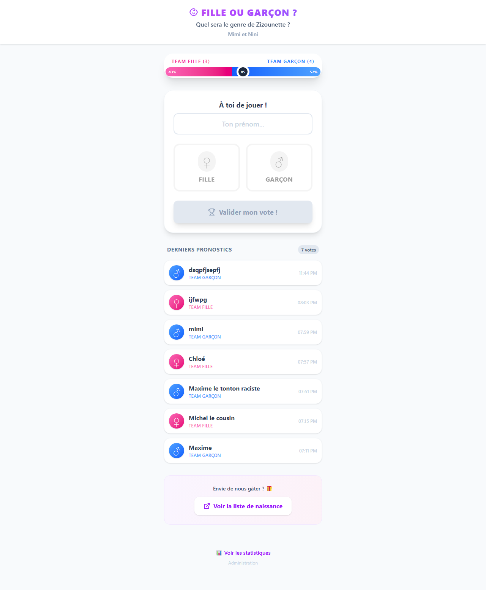
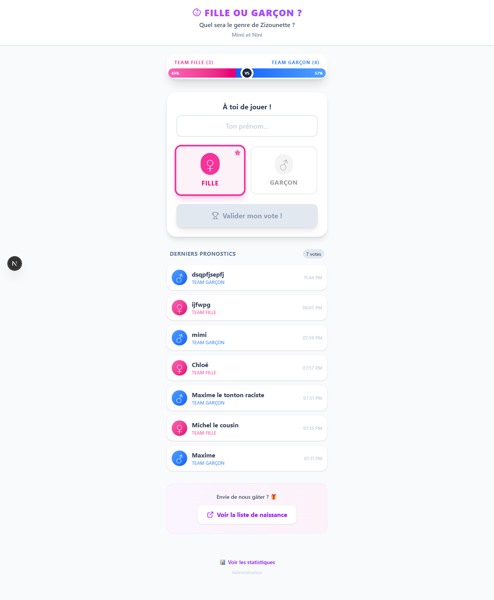
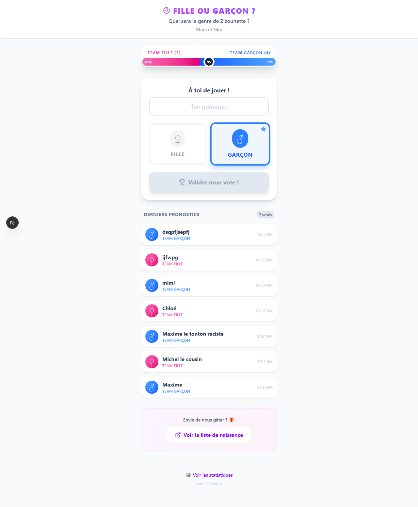
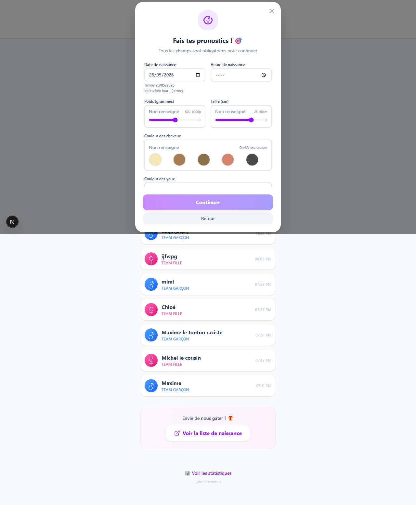
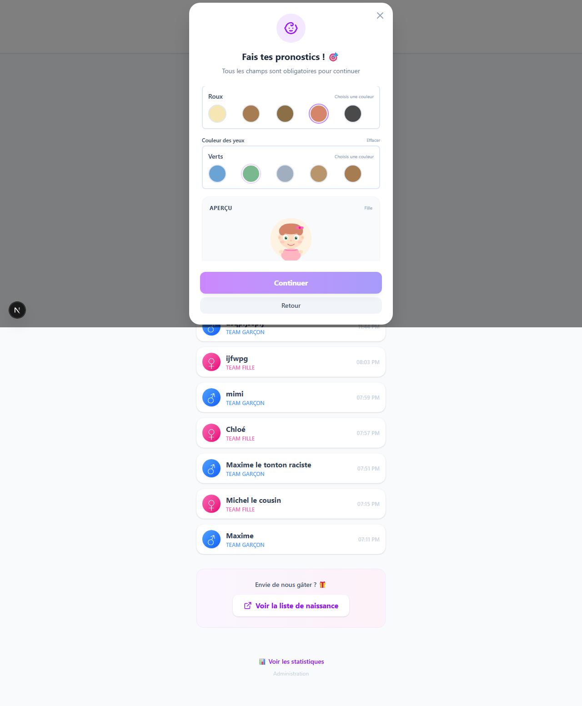
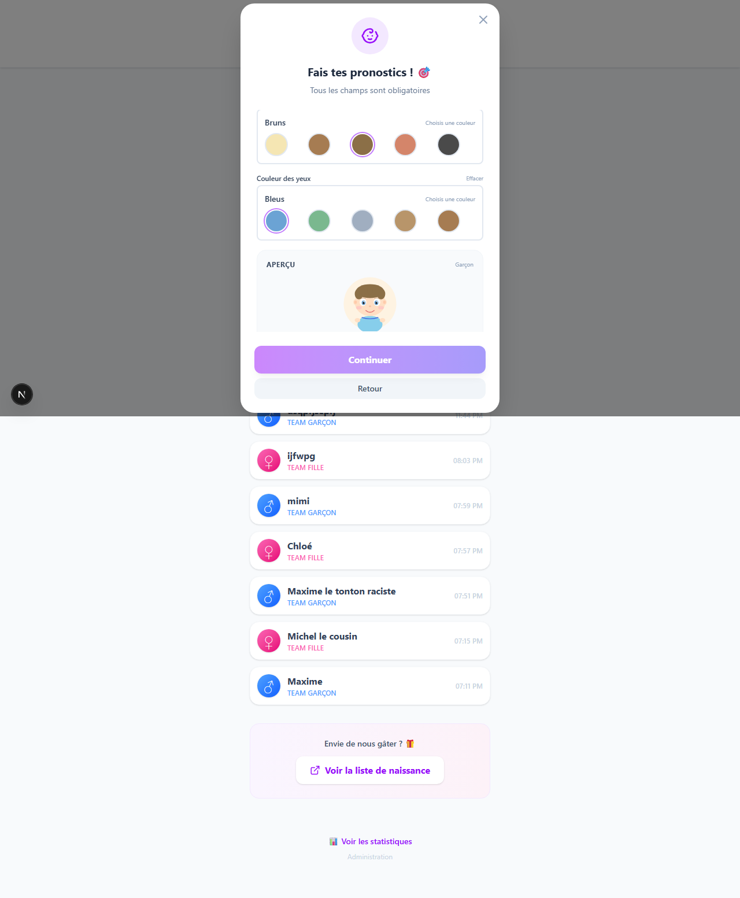
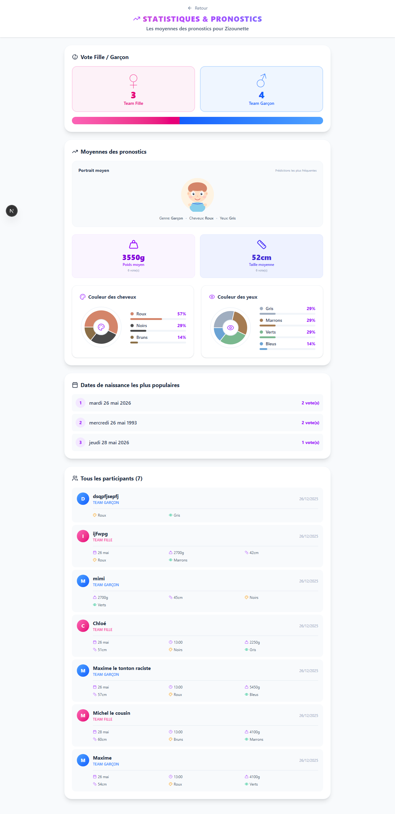
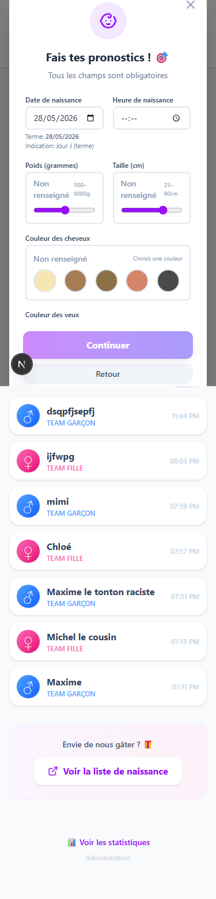

# Documentation Visuelle - Gender Reveal App

## 📱 Interface Utilisateur

### Page Principale

#### Vue Initiale


La page d'accueil permet aux utilisateurs de :
- Entrer leur prénom
- Sélectionner leur prédiction (Fille ou Garçon)
- Accéder aux prédictions avancées
- Voir les statistiques

---

#### Sélection Fille


Interface avec le bouton "Fille" sélectionné (rose).

---

#### Sélection Garçon


Interface avec le bouton "Garçon" sélectionné (bleu).

---

## 🎯 Modales - Prédictions Avancées

### Modal Prédictions


Modal permettant de faire des prédictions détaillées :
- **Date de naissance** (calendrier) - Préremplie automatiquement avec la date du terme si configurée
- **Indicateur J-/J+** - Affiche le nombre de jours avant/après le terme (si date du terme configurée)
- **Heure de naissance** (time picker 24h)
- **Poids** (slider de 500g à 6000g) - Valeur par défaut : 3300g, peut être effacée
- **Taille** (slider de 25cm à 60cm) - Valeur par défaut : 50cm, peut être effacée
- **Couleur des cheveux** (5 options : Blonds, Châtains, Bruns, Roux, Noirs) - Peut être effacée
- **Couleur des yeux** (5 options : Bleus, Verts, Gris, Noisette, Marrons) - Peut être effacée
- **Aperçu du bébé en temps réel** - BabyAvatar mis à jour dynamiquement selon les sélections
- **Tous les champs sont obligatoires** pour continuer vers la modal email

---

### Prédictions avec Couleurs


Exemple avec des couleurs sélectionnées montrant :
- L'aperçu du BabyAvatar mis à jour dynamiquement
- Les couleurs de cheveux et yeux choisies
- Le système de couches SVG modulaire

---

## 📧 Modal Email



Modal de validation finale permettant :
- D'entrer son email (optionnel)
- "Envoyer mon vote avec email"
- "Continuer sans email"

---

## 📊 Page Résultats



Page de statistiques affichant :
- Distribution des votes (♀ vs ♂) avec compteurs détaillés
- Portrait moyen du bébé prédit (BabyAvatar avec couleurs les plus populaires)
- Statistiques détaillées (poids moyen, taille moyenne)
- **Roues de couleurs interactives** (pie charts) pour cheveux et yeux avec pourcentages
- Dates de naissance les plus populaires (top 5)
- Liste complète des participants avec tous leurs pronostics détaillés
- Horodatage de chaque vote

### Fonctionnalités Avancées de la Page Résultats

**Roues de Couleurs (ColorWheelPastel)**
- Graphiques circulaires (pie charts) pour visualiser la distribution des couleurs
- Légende avec barres de progression pour chaque couleur
- Pourcentages calculés dynamiquement
- Couleurs douces adaptées au thème gender reveal

**Portrait Moyen**
- Avatar généré automatiquement avec les prédictions les plus fréquentes
- Genre majoritaire, couleur de cheveux et yeux les plus votés
- Affichage en taille 112px (plus grand que dans la modal)

**Dates Populaires**
- Top 5 des dates de naissance les plus prédites
- Format français complet (jour de la semaine, date complète)
- Compteur de votes par date

---

## ⚙️ Page Administration


Interface d'administration pour :
- **Statistiques en temps réel** - Total votes, Team Fille, Team Garçon
- **Configuration de l'application** :
  - Surnom du bébé (affiché dans "Quel sera le genre de...")
  - Noms des parents
  - Lien vers la liste de naissance
  - **Format de date** - Choisir parmi 6 formats (DD/MM/YYYY, MM/DD/YYYY, YYYY-MM-DD, DD MMM YYYY, DD MMMM YYYY, DD/MM/YY)
    - Aperçu en temps réel du format sélectionné
    - S'applique à toutes les dates de l'application
  - **Date du terme** - Utilisée pour l'indicateur J-/J+ dans la modal de prédictions
- **Révélation du sexe** :
  - Activer/désactiver la révélation
  - Sélectionner le sexe réel (Fille/Garçon)
  - Affiche une page spéciale de révélation quand activée
- **Gestion des votes** :
  - Voir tous les votes avec pronostics détaillés
  - Supprimer tous les votes (avec confirmation)
- **Liens rapides** vers page publique et statistiques

### Configuration du Format de Date

Le panel admin permet de configurer le format d'affichage des dates pour toute l'application :

**Formats disponibles :**
- **DD/MM/YYYY** (26/05/2026) - Format français standard - Par défaut
- **MM/DD/YYYY** (05/26/2026) - Format américain
- **YYYY-MM-DD** (2026-05-26) - Format ISO
- **DD MMM YYYY** (26 mai 2026) - Format long avec mois abrégé
- **DD MMMM YYYY** (26 mai 2026) - Format très long avec mois complet
- **DD/MM/YY** (26/05/26) - Format court avec année à 2 chiffres

**Application automatique :**
Le format choisi s'applique immédiatement à :
- ✅ **Date pickers** - Les champs de saisie de date affichent et acceptent le format configuré
  - Formats numériques (DD/MM/YYYY, MM/DD/YYYY, etc.) : saisie directe possible
  - Formats avec mois en texte (DD MMM YYYY, DD MMMM YYYY) : sélection via calendrier
- ✅ Dates de naissance dans les prédictions (modales)
- ✅ Dates populaires dans les statistiques
- ✅ Timestamps des votes (date + heure)
- ✅ Date du terme affichée dans les modales et l'admin
- ✅ Toutes les dates dans les listes de votes
- ✅ Dates dans le panel admin

### Page de Révélation du Sexe

Quand la révélation est activée dans l'admin, la page principale affiche :
- Fond dégradé rose (fille) ou bleu (garçon)
- Symbole géant animé (♀ ou ♂)
- Message "C'est une FILLE !" ou "C'est un GARÇON !"
- Nom du bébé personnalisé si configuré
- Lien pour voir les pronostics

---

## 📱 Version Mobile

### Page Principale Mobile


Design responsive optimisé pour mobile (375×667).

---

### Modal Mobile


Modal de prédictions adaptée aux petits écrans.

---

## 🎨 Système BabyAvatar (Paperdoll)

Le système d'avatar utilise une architecture **inspirée de DiceBear** mais entièrement personnalisée :

### Architecture en Couches SVG

```
BabyAvatar (composant principal)
├── BabyBase (tête, cou, épaules)
│   └── Couleur: skinTone prop
├── BabyEyes (yeux avec reflets, sourcils)
│   └── Couleur: eyeColor prop
├── BabyFace (nez, bouche, joues)
├── BabyHair (3 styles: default, short, curly)
│   └── Couleur: hairColor prop
├── BabyAccessory (nœud pour filles, bleu pour garçons)
│   └── Couleur: selon gender prop
└── BabyClothing (t-shirt avec ombre)
    └── Couleur: clothingColor prop
```

### Props du Composant

```typescript
interface BabyAvatarProps {
  hairColor?: string;      // Hex color
  eyeColor?: string;       // Hex color
  gender?: 'girl' | 'boy';
  size?: number;           // 96 ou 112
  skinTone?: string;       // Default: #fdd5b1
  hairStyle?: 'default' | 'short' | 'curly';
  clothingColor?: string;  // Default: #e0e7ff
}
```

### Pourquoi Pas DiceBear Directement ?

- ❌ DiceBear n'a **pas de style "bébé"**
- ❌ Les styles existants (avataaars, bottts, etc.) ne conviennent pas à un gender reveal
- ✅ Architecture paperdoll **inspirée** de DiceBear
- ✅ **SVG 100% custom** pour ressembler à un bébé
- ✅ **6 couches modulaires** pour customisation complète

### Exemple d'Utilisation

```tsx
import { BabyAvatar } from '@/components/BabyAvatar';

<BabyAvatar 
  hairColor="#d4856a"    // Roux
  eyeColor="#7ab88f"     // Vert
  gender="girl"
  size={96}
  hairStyle="curly"
/>
```

---

## 🧪 Tests Automatisés

Suite de 12 tests Playwright couvrant :
- ✅ Navigation et chargement
- ✅ Sélection de genre
- ✅ Sliders et contrôles
- ✅ Palettes de couleurs
- ✅ Avatar dynamique
- ✅ Modales (prédictions + email)
- ✅ Symboles de genre
- ✅ Responsive design

```bash
npm run test        # Tous les tests
npm run test:ui     # Interface graphique
npm run test:headed # Mode visible
```

---

## 🎯 Fonctionnalités Clés

### 1. Système de Vote Intuitif
- Champ prénom avec validation
- Boutons Fille/Garçon stylisés avec animations
- **Rafraîchissement automatique** des votes toutes les 10 secondes
- Barre de progression en temps réel (Team Fille vs Team Garçon)
- Liste des derniers votes avec horodatage
- Confetti animation après vote réussi

### 2. Prédictions Avancées (Obligatoires dans la modal)
- Date et heure de naissance
- **Préremplissage automatique** de la date avec la date du terme (si configurée)
- **Indicateur J-/J+** montrant les jours avant/après le terme
- Sliders pour poids/taille avec feedback visuel et valeurs par défaut
- Boutons "Effacer" pour réinitialiser poids, taille et couleurs
- Palettes de couleurs interactives (5 couleurs pour cheveux et yeux)
- Aperçu BabyAvatar en temps réel mis à jour à chaque changement
- Validation : tous les champs doivent être remplis pour continuer

### 3. Avatar Dynamique
- Rendu SVG léger et performant
- 6 couches modulaires
- Mise à jour instantanée
- Support de 3 styles de cheveux

### 4. Design Responsive
- Mobile-first (375px+)
- Tablette (768px+)
- Desktop (1024px+)
- Modales adaptatives

### 5. Statistiques Détaillées
- Graphiques de distribution (barres de progression)
- **Roues de couleurs** (pie charts) pour cheveux et yeux avec pourcentages
- Portrait moyen calculé automatiquement
- Moyennes poids/taille (calculées uniquement sur les votes ayant ces données)
- Top 5 des dates de naissance les plus populaires
- Historique complet des votes avec tous les pronostics détaillés
- Affichage responsive avec grilles adaptatives

---

## 🚀 Technologies

- **Next.js 16.1** (App Router + Turbopack)
- **React 19.2**
- **TypeScript 5**
- **Tailwind CSS**
- **Playwright** (tests E2E)
- **SVG** (avatars custom)
- **Lucide Icons**

---

## 📝 Notes Techniques

### Stockage
- Fichier JSON local (`data/votes.json`, `data/config.json`)
- API Routes Next.js
- Pas de base de données externe

### Performance
- SVG optimisé (léger, pas d'images lourdes)
- Composants React memoïzés
- Chargement progressif
- Animations CSS natives

### Accessibilité
- Labels ARIA sur les boutons de couleur
- Contrôles clavier
- Contrastes WCAG AA
- Textes alternatifs

---

*Documentation mise à jour le 26 décembre 2025*
